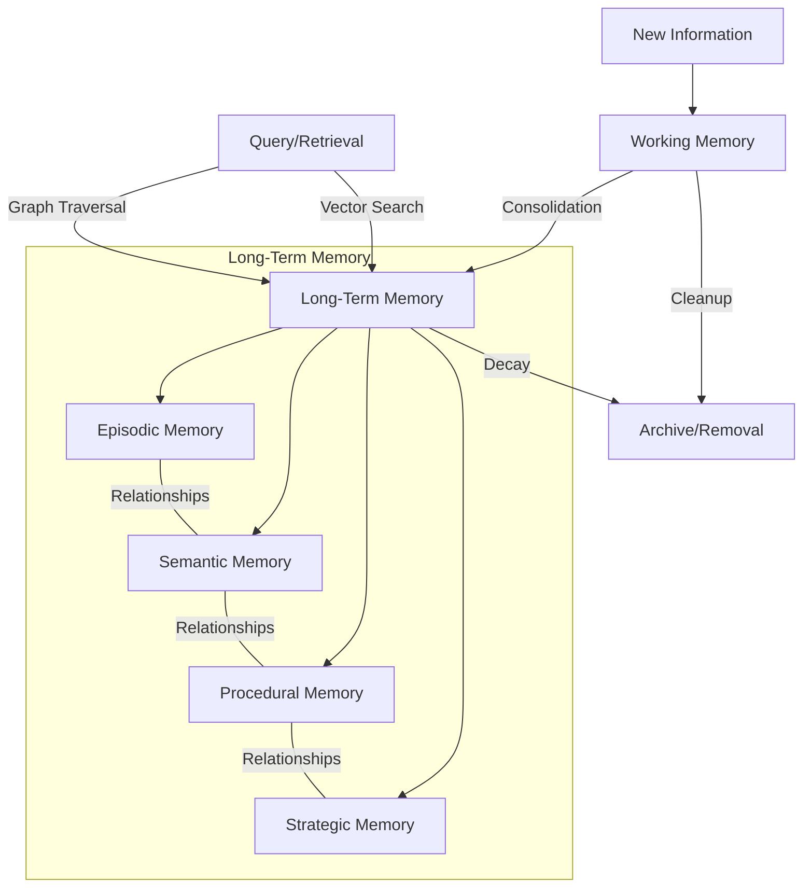

# AGI Memory System

A sophisticated database design for Artificial General Intelligence (AGI) memory management, implementing multiple types of memory storage and retrieval mechanisms inspired by human cognitive architecture.

## Overview

This system provides a comprehensive memory management solution for AGI applications, featuring:

- Multiple memory types (Episodic, Semantic, Procedural, Strategic)
- Vector-based memory storage and similarity search
- Graph-based memory relationships
- Dynamic memory importance calculation
- Memory decay simulation
- Working memory system
- Memory consolidation mechanisms

## Architecture

### Memory Types

1. **Working Memory**
   - Temporary storage for active processing
   - Automatic expiry mechanism
   - Vector embeddings for content similarity

2. **Episodic Memory**
   - Event-based memories with temporal context
   - Stores actions, contexts, and results
   - Emotional valence tracking
   - Verification status

3. **Semantic Memory**
   - Fact-based knowledge storage
   - Confidence scoring
   - Source tracking
   - Contradiction management
   - Categorical organization

4. **Procedural Memory**
   - Step-by-step procedure storage
   - Success rate tracking
   - Duration monitoring
   - Failure point analysis

5. **Strategic Memory**
   - Pattern recognition storage
   - Adaptation history
   - Context applicability
   - Success metrics

### Key Features

- **Vector Embeddings**: Uses pgvector for similarity-based memory retrieval
- **Graph Relationships**: Apache AGE integration for complex memory relationships
- **Dynamic Scoring**: Automatic calculation of memory importance and relevance
- **Memory Decay**: Time-based decay simulation for realistic memory management
- **Change Tracking**: Historical tracking of memory modifications

## Technical Stack

- **Database**: PostgreSQL with extensions:
  - pgvector (vector similarity)
  - AGE (graph database)
  - btree_gist
  - pg_trgm
  - cube

## Setup

```
cp .env.local .env # modify the .env file with your own values
docker compose up -d
```

This will:
1. Start a PostgreSQL instance with all required extensions (pgvector, AGE, etc.)
2. Initialize the database schema
3. Create necessary tables, functions, and triggers

## Testing

Run the test suite with:

`pytest test.py -v`

## Database Schema

### Core Tables
1. **working_memory**
   - Temporary storage with automatic expiry
   - Vector embeddings for similarity search
   - Priority scoring for attention mechanisms

2. **long_term_memory**
   - Permanent storage for consolidated memories
   - Links to specific memory type tables
   - Metadata tracking (creation, modification, access)

3. **memory_relationships**
   - Graph-based relationship storage
   - Bidirectional links between memories
   - Relationship type classification

### Memory Type Tables
Each specialized memory type has its own table with type-specific fields:
- episodic_memory
- semantic_memory
- procedural_memory
- strategic_memory

### Indexes and Constraints
- Vector indexes for similarity search
- Graph indexes for relationship traversal
- Temporal indexes for time-based queries

## Example Queries

### Memory Retrieval
```sql
-- Find similar memories using vector similarity
SELECT * FROM long_term_memory
WHERE embedding <-> query_embedding < threshold
ORDER BY embedding <-> query_embedding
LIMIT 10;

-- Find related memories through graph
SELECT * FROM ag_catalog.cypher('memory_graph', $$
    MATCH (m:MemoryNode)-[:RELATES_TO]->(related)
    WHERE m.id = $memory_id
    RETURN related
$$) as (related agtype);
```

## System Maintenance

The memory system requires three key maintenance processes to function effectively:

### 1. Memory Consolidation
Short-term memories need to be consolidated into long-term storage. This process should:
- Move frequently accessed items from working memory to permanent storage
- Run periodically (recommended every 4-6 hours)
- Consider memory importance and access patterns

### 2. Memory Pruning
The system needs regular cleanup to prevent overwhelming storage:
- Archive or remove low-relevance memories
- Decay importance scores of unused memories
- Run daily or weekly, depending on system usage

### 3. Database Optimization
Regular database maintenance ensures optimal performance:
- Reindex tables for efficient vector searches
- Update statistics for query optimization
- Run during off-peak hours

### Implementation Note
These maintenance tasks can be implemented using:
- Database scheduling tools
- External task schedulers
- System-level scheduling (cron, systemd, etc.)

Choose the scheduling method that best fits your infrastructure and monitoring capabilities. Ensure proper logging and error handling for all maintenance operations.

## Usage Guide

### Memory Interaction Flow

The AGI Memory System provides a layered approach to memory management, similar to human cognitive processes:

1. **Initial Memory Creation**
   - New information enters through working memory
   - System assigns initial importance scores
   - Vector embeddings are generated for similarity matching

2. **Memory Retrieval**
   - Query across multiple memory types simultaneously
   - Use similarity search for related memories
   - Access through graph relationships for connected concepts

3. **Memory Updates**
   - Automatic tracking of memory modifications
   - Importance scores adjust based on usage
   - Relationships update dynamically

4. **Memory Integration**
   - Cross-referencing between memory types
   - Automatic relationship discovery
   - Pattern recognition across memories



### Key Integration Points

- Use the API for all memory operations
- Implement proper error handling for failed operations
- Monitor memory usage and system performance
- Regular backup of critical memories

### Best Practices

- Initialize working memory with reasonable size limits
- Implement rate limiting for memory operations
- Regular validation of memory consistency
- Monitor and adjust importance scoring parameters

## Important Note

This database schema is designed for a single AGI instance. Supporting multiple AGI instances would require significant schema modifications, including:

- Adding AGI instance identification to all memory tables
- Partitioning strategies for memory isolation
- Modified relationship handling for cross-AGI memory sharing
- Separate working memory spaces per AGI
- Additional access controls and memory ownership

If you need multi-AGI support, consider refactoring the schema to include tenant isolation patterns before implementation. 
